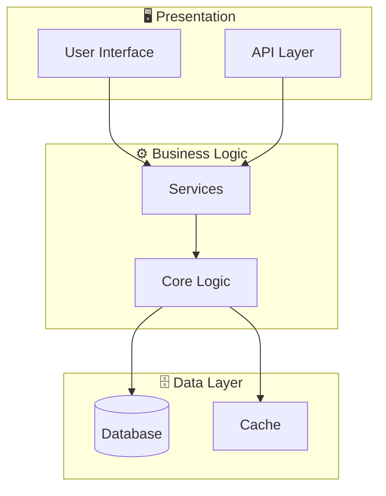
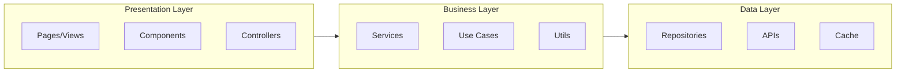

# System Architecture - fb56082f-02fc-47db-a636-69fd6aebc3df

## Architecture Overview

**Pattern:** Monolithic with a Service-Oriented approach



## Application Layers



## Technology Stack

| Layer | Technology | Purpose |
|-------|------------|---------|
| Language | Python | Main language |

## Directory Structure

```
src/
├── main.py/
├── llm/
├── __init__.py/
├── services/
├── config.py/
└── ... (+2 more)
```

---

*Generated by Code Analysis Agent on February 10, 2026*
