# System Architecture - fb56082f-02fc-47db-a636-69fd6aebc3df

## Architecture Overview

**Pattern:** Monolithic with a Service-Oriented approach

```mermaid
flowchart TB
    subgraph Presentation["🖥️ Presentation"]
        UI[User Interface]
        API[API Layer]
    end
    
    subgraph Business["⚙️ Business Logic"]
        Services[Services]
        Logic[Core Logic]
    end
    
    subgraph Data["🗄️ Data Layer"]
        DB[(Database)]
        Cache[Cache]
    end
    
    UI --> Services
    API --> Services
    Services --> Logic
    Logic --> DB
    Logic --> Cache
```



## Application Layers


## Technology Stack

| Layer | Technology | Purpose |
|-------|------------|---------|
| Language | Python | Main language |

## Directory Structure

```
src/
├── main.py/
├── llm/
├── __init__.py/
├── services/
├── config.py/
└── ... (+2 more)
```

---

*Generated by Code Analysis Agent on February 10, 2026*
