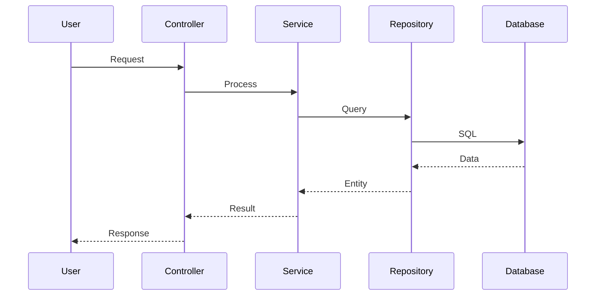

# Flows and Sequences - fb56082f-02fc-47db-a636-69fd6aebc3df

## Main Flows

The main system flows include:

1. **Input Flow** - Receiving and validating data
2. **Processing Flow** - Applying business rules
3. **Output Flow** - Responding to client

Check sequence diagrams below for details.

## Sequence Diagrams

---

*Generated by Code Analysis Agent on February 10, 2026*
