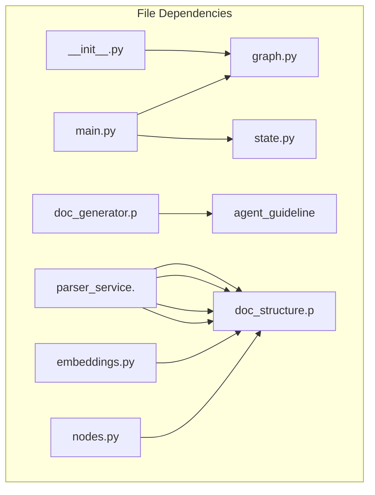

# Dependency Graph - fb56082f-02fc-47db-a636-69fd6aebc3df

## Statistics

| Metric | Value |
|--------|-------|
| Total Files | 20 |
| Total Functions | 0 |
| Total Classes | 0 |

## Overview

## Most Connected Modules

- **src/templates/doc_structure.py**: 6 connections
- **src/services/parser_service.py**: 4 connections
- **src/main.py**: 2 connections
- **src/graph/graph.py**: 2 connections
- **src/graph/state.py**: 1 connections
- **src/templates/doc_generator.py**: 1 connections
- **src/templates/agent_guidelines.py**: 1 connections
- **src/graph/nodes.py**: 1 connections
- **src/graph/__init__.py**: 1 connections
- **src/llm/embeddings.py**: 1 connections

---

*Generated by Code Analysis Agent on February 10, 2026*
